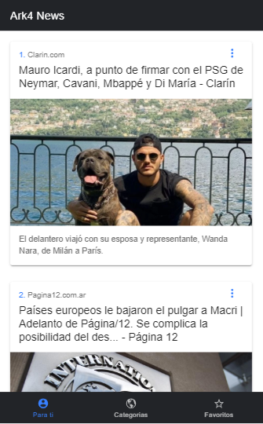
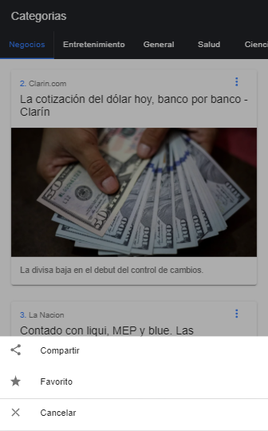
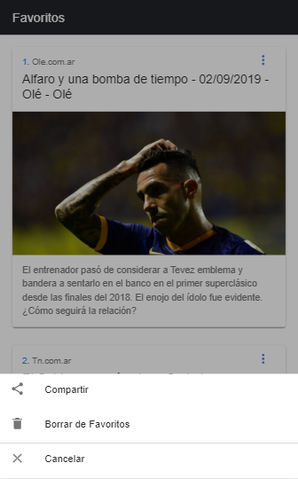

# Vista previa de la aplicación

 

 

Para probar la aplicacion es necesarion regitrarse en la pagina [News API](https://newsapi.org).
Una vez registrados podran obtener un api key en el cual deberan colocarlo en el archivo de los environments del proyecto que se encuentra en src/environments 

~~~js
export const environment = {
  production: false,
  apikey: 'AQUI DEBES PONER TU API KEY',
  apiUrl: 'https://newsapi.org/v2'
};
~~~

